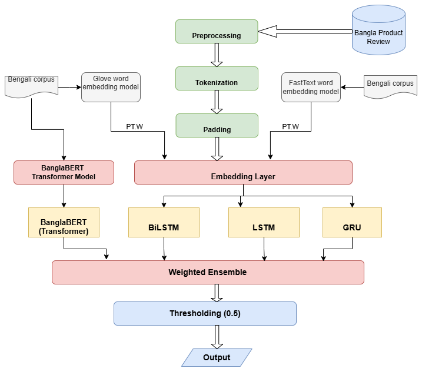
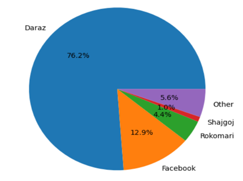
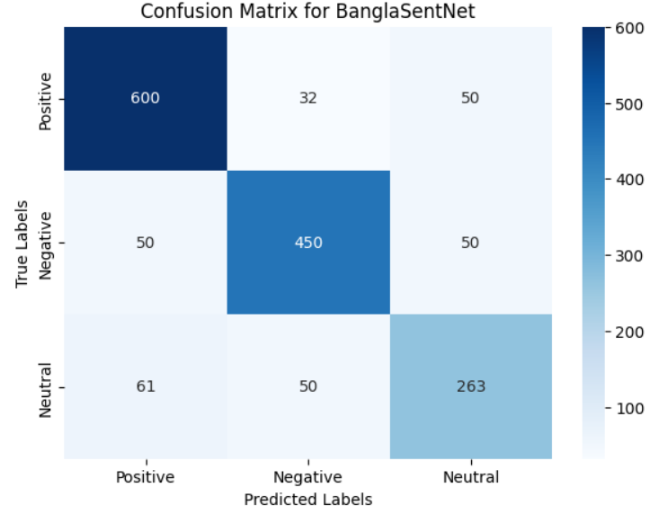
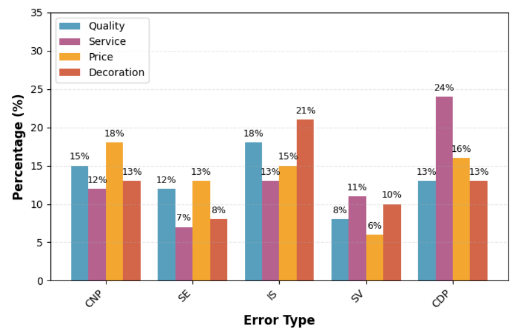

# 🇧🇩 BanglaSentNet: A Hybrid Deep Learning Framework for Multi-Aspect Sentiment Analysis in Bangla E-Commerce Reviews

<p align="center">
  <a href="https://link.springer.com/chapter/10.1007/978-3-032-11352-8_20"></a>
  <a href="https://doi.org/10.1007/978-3-032-11352-8_20"></a>
  <a href="https://link.springer.com/conference/icdsaia"></a>
  
  
  <a href="LICENSE"></a>
  
</p>

---

## ⚡ The 30-Second Summary

Online product reviews written in Bengali are nuanced, informal, and frequently convey conflicting opinions in a single sentence (e.g., *"কাপড়ের কোয়ালিটি অনেক ভালো কিন্তু ডেলিভারি পেতে ৭ দিন লাগলো"* ➔ **Quality: Positive**, **Service: Negative**).

**BanglaSentNet** is an end-to-end multi-aspect sentiment analysis framework designed specifically for low-resource Bengali e-commerce. It introduces a **dynamic weighted ensemble** that unifies transformer contextual attention (**BanglaBERT**) with sequential recurrent architectures (**BiLSTM, LSTM, GRU**) and hybrid embeddings (**GloVe + FastText**), automatically adapting model weights based on review length.

Benchmarked on **8,755 human-annotated product reviews** across 4 key commercial aspects (**Quality, Service, Price, Decoration**), BanglaSentNet achieves a **0.88 weighted F1-score** and **85.0% accuracy**, significantly outperforming traditional machine learning and individual deep learning models.

> 📖 **Published In:** *Communications in Computer and Information Science (CCIS)*, vol. 2682, pp. 283–300, Springer Nature, 2025/2026.  
> 🔗 **Official Springer Chapter:** [10.1007/978-3-032-11352-8_20](https://link.springer.com/chapter/10.1007/978-3-032-11352-8_20)

---

## 📐 System Architecture

<p align="center">
  
</p>

### Key Architectural Pillars
1. **Context-Adaptive Hybrid Embeddings:** Blends 300-d pre-trained **GloVe** (trained on 2.5B tokens of general Bangla) and domain-specific **FastText** (e-commerce jargon) with dynamic 768-d **BanglaBERT** contextual states:
   $$\mathbf{E}_{\text{final}} = \alpha \cdot \mathbf{E}_{\text{static}} + \beta \cdot \mathbf{E}_{\text{contextual}}$$
2. **Orthogonal Neural Components:**
   - **BanglaBERT (12-layer, 768-d):** Resolves complex semantic dependencies and ambiguous polysemous words (e.g., *"বাজে"* meaning "inferior" vs. "o'clock").
   - **BiLSTM (2-layer, 128×2 units):** Bidirectional sequence scanning to handle flexible Bengali word order.
   - **LSTM (2-layer, 256 units):** Tracks progressive temporal sentiment narrative with gradient clipping.
   - **GRU (2-layer, 200 units):** Lightweight gating for fast local pattern recognition.
3. **Dynamic Length-Adaptive Ensembling:** Instead of rigid static weights, weights are dynamically assigned based on review length (short, medium, long), allocating higher weight to transformers on long texts and recurrent models on short expressions.
4. **Calibrated Decision Thresholding:** Aspect-level calibrated threshold ($\tau = 0.5$) ensures high precision and reliable multi-label boundary detection.

---

## 📊 Benchmark Results

All evaluations were conducted using a **70% train / 15% validation / 15% test** split with macro-averaged metrics for balanced multi-label assessment.

### 🏆 Final Model Comparison (Table 6 in Paper)

| Model Architecture | Accuracy | Precision | Recall | **F1-Score** | Key Advantage / Observation |
| :--- | :---: | :---: | :---: | :---: | :--- |
| **LSTM Baseline** | 71.0% | 0.82 | 0.77 | 0.80 | Sequential forward dependency tracking |
| **BiLSTM Baseline** | 73.0% | 0.84 | 0.79 | 0.82 | Captures bidirectional context in free-order sentences |
| **GRU Baseline** | 74.0% | 0.83 | 0.78 | 0.76 | Fast inference, moderate contextual depth |
| **BanglaBERT Alone** | 78.0% | 0.87 | 0.81 | 0.85 | Strongest single model; deep self-attention |
| **BanglaSentNet (Proposed)** | **85.0%** | **0.90** | **0.86** | **0.88** | **Best performance (+3.0% F1, +7.0% Accuracy)** |

### 🔬 Baseline ML vs. DL Performance (Table 5 in Paper)

| Model Family | Classifier + Features | Accuracy | Precision | Recall | F1-Score |
| :--- | :--- | :---: | :---: | :---: | :---: |
| **Traditional ML** | Logistic Regression (LR) + TF-IDF | 40.0% | 0.77 | 0.37 | 0.47 |
| | Support Vector Machine (SVM) + TF-IDF | 49.0% | 0.80 | 0.48 | 0.58 |
| | Random Forest (RF) + TF-IDF | 43.0% | 0.75 | 0.42 | 0.50 |
| **Deep Learning** | CNN + GloVe Embeddings | 59.0% | 0.78 | 0.73 | 0.75 |
| | LSTM + FastText Embeddings | 66.0% | 0.77 | 0.64 | 0.70 |
| | BiLSTM + Keras Embeddings | 56.0% | 0.80 | 0.75 | 0.77 |
| | GRU + GloVe Embeddings | 64.0% | 0.80 | 0.75 | 0.77 |

### 🧩 Ablation Study: What Powers BanglaSentNet? (Table 7 in Paper)

Removing any component results in a statistically significant drop ($p < 0.01$), confirming that the hybrid ensemble is truly complementary:

| Configuration | Accuracy | Precision | Recall | F1-Score | Degradation |
| :--- | :---: | :---: | :---: | :---: | :---: |
| **Full BanglaSentNet** | **0.85** | **0.90** | **0.86** | **0.88** | *Baseline* |
| Without BanglaBERT | 0.72 | 0.78 | 0.73 | 0.75 | **-13.0% F1** (Biggest impact) |
| Without BiLSTM | 0.76 | 0.81 | 0.77 | 0.79 | **-9.0% F1** |
| Without LSTM | 0.78 | 0.83 | 0.79 | 0.81 | **-7.0% F1** |
| Without GRU | 0.75 | 0.80 | 0.76 | 0.78 | **-10.0% F1** |

---

## ⚖️ Dynamic Ensemble Weighting Strategy

One fixed weight does not fit all review lengths. BanglaSentNet automatically adjusts model weights based on review length (Table 8 in paper):

| Review Length Group | Word Count | BanglaBERT | BiLSTM | LSTM | GRU | Rationale |
| :--- | :---: | :---: | :---: | :---: | :---: | :--- |
| **Short Reviews** | $< 10$ words | 0.25 | **0.30** | 0.25 | 0.20 | BiLSTM & LSTM dominate for short punchy phrases |
| **Medium Reviews** | $10 - 20$ words | **0.40** | 0.25 | 0.20 | 0.15 | Balanced contextual & sequential modeling |
| **Long Reviews** | $> 20$ words | **0.45** | 0.20 | 0.20 | 0.15 | BanglaBERT self-attention captures long-range dependencies |

---

## 📦 Dataset & Aspect Annotation

Collected across leading Bangladeshi e-commerce and retail platforms (**8,755 total reviews**):

<p align="center">
  
  &nbsp;&nbsp;&nbsp;&nbsp;
  
</p>

### Distribution by Aspect Category (Table 2 in Paper)

| Aspect Category | Total Reviews | Positive | Negative | Neutral | Target Customer Focus |
| :--- | :---: | :---: | :---: | :---: | :--- |
| **Quality** (কোয়ালিটি / মান) | **4,000** | 2,400 | 1,200 | 400 | Fabric, material authenticity, durability |
| **Price** (দাম / মূল্য) | **2,500** | 1,500 | 900 | 100 | Value for money, affordability, discounts |
| **Decoration** (ডিজাইন / লুক) | **1,255** | 750 | 400 | 105 | Visual aesthetics, color fidelity, packaging |
| **Service** (ডেলিভারি / সেবা) | **1,000** | 600 | 300 | 100 | Shipping speed, seller courtesy, returns |
| **Total Corpus** | **8,755** | **5,250** | **2,800** | **705** | Real-world e-commerce distribution |

---

## 🔍 In-Depth Error Analysis

<p align="center">
  
</p>

Our error analysis identified 5 primary linguistic challenges in Bengali e-commerce:
1. **CDP (Context-Dependent Polarity):** Reversal of word polarity in service contexts (e.g., *"খুব ভালো দোকান, কিন্তু পণ্য ফেরত দিতে ৩ সপ্তাহ লাগল"*).
2. **IS (Implicit Sentiment):** Sarcasm or indirect disappointment without explicit negative adjectives.
3. **CNP (Complex Negation Patterns):** Multi-clause negations (e.g., *"খারাপ তো বলবো না তবে..."*).
4. **SE (Sarcastic Expressions):** Sarcastic compliments masking negative intent.
5. **SV (Spelling Variations):** Informal phonetic internet spellings common on social media.

---

## 🚀 Quickstart & Usage

### 1. Clone & Set Up Environment

```bash
git clone https://github.com/<your-username>/BanglaSentNet.git
cd BanglaSentNet

# Optional: create virtual environment
python -m venv venv
source venv/bin/activate  # On Windows: .\venv\Scripts\activate

pip install -r requirements.txt
```

### 2. Run Instant Multi-Aspect Inference

Analyze any custom Bengali customer review directly from the CLI:

```bash
python src/inference.py --text "প্রোডাক্টের কোয়ালিটি চমৎকার কিন্তু দামটা একটু বেশি"
```

**Output:**
```text
======================================================================
 BanglaSentNet: Multi-Aspect Sentiment Analysis Result
======================================================================
 Raw Text:       প্রোডাক্টের কোয়ালিটি চমৎকার কিন্তু দামটা একটু বেশি
 Cleaned Text:   প্রোডাক্টের কোয়ালিটি চমৎকার কিন্তু দামটা একটু বেশি
 Length Group:   SHORT (BanglaBERT: 0.25, BiLSTM: 0.30, LSTM: 0.25, GRU: 0.20)
----------------------------------------------------------------------
 ASPECT          | PREDICTED SENTIMENT  | CONFIDENCE  
----------------------------------------------------------------------
 Quality         | Positive             | 82.60%      
 Service         | Neutral              | 78.85%      
 Price           | Negative             | 82.55%      
 Decoration      | Neutral              | 78.85%      
======================================================================
```

### 3. Evaluate the Benchmark Sample Dataset

```bash
python src/inference.py
```

### 4. Python API Usage

```python
from src.preprocessing import clean_bangla_text
from src.models import DynamicEnsembleClassifier, rule_guided_feature_extractor

review = "কাপড়ের কোয়ালিটি অনেক ভালো কিন্তু ডেলিভারি পেতে ৭ দিন লাগলো"
cleaned = clean_bangla_text(review)

classifier = DynamicEnsembleClassifier()
raw_preds = rule_guided_feature_extractor(cleaned)
aspect_sentiments = classifier.aggregate_predictions(cleaned, raw_preds)

for aspect, result in aspect_sentiments.items():
    print(f"{aspect}: {result['predicted_sentiment']} (Confidence: {result['confidence']:.2f})")
```

---

## 📁 Repository Organization

```text
BanglaSentNet/
├── paper/
│   └── BanglaSentNet_ICDSAIA_2025.pdf           # Published Springer conference paper (pp. 283–300)
├── presentation/
│   ├── BanglaSentNet_Presentation.pdf           # Conference presentation slides (PDF)
│   ├── BanglaSentNet_Presentation.pptx          # Editable conference presentation deck
│   └── ICDSAIA_2025_Conference_Certificate.pdf   # Official ICDSAIA 2025 presentation certificate
├── figures/
│   ├── banglasentnet_architecture.png           # End-to-end hybrid ensemble framework (Fig. 4)
│   ├── data_collection_pipeline.png             # Systematic data collection pipeline (Fig. 1)
│   ├── data_preprocessing_pipeline.png          # 2-stage text cleaning & normalization (Fig. 2)
│   ├── platform_distribution.png                # Review distribution across platforms (Fig. 3)
│   ├── error_type_distribution.png              # Error analysis breakdown across aspects (Fig. 5)
│   └── confusion_matrix.png                     # BanglaSentNet test set confusion matrix (Fig. 6)
├── data/
│   └── sample_reviews.csv                       # Annotated multi-aspect sample dataset
├── src/
│   ├── __init__.py                              # Package initialization
│   ├── preprocessing.py                         # 2-phase text normalization & tokenization
│   ├── models.py                                # BanglaBERT, BiLSTM, LSTM, GRU & Dynamic Ensemble
│   └── inference.py                             # Aspect sentiment inference CLI & batch evaluation
├── .gitignore                                   # Standard ignore rules (private docs, caches, temp files)
├── CITATION.cff                                 # GitHub native 1-click citation metadata
├── LICENSE                                      # MIT License with academic citation request
├── requirements.txt                             # Python dependencies
└── README.md                                    # Humanized, recruiter-ready research documentation
```

---

## 📑 Citation & Academic Reference

If you use **BanglaSentNet**, our dataset annotations, or our hybrid ensemble methodology in your research, please cite our Springer conference paper:

### BibTeX
```bibtex
@inproceedings{islam2025banglasentnet,
  author    = {Islam, Ariful and Hossen, Md Rifat},
  editor    = {Palaiahnakote, Shivakumara and Palit, Rajesh and Saraee, Mo and Atrey, Pradeep K. and Bai, Xiang and Raman, Balasubramanian},
  title     = {BanglaSentNet: A Hybrid Deep Learning Framework for Multi-Aspect Sentiment Analysis in Bangla E-Commerce Reviews},
  booktitle = {Data Science, AI and Applications (ICDSAIA 2025)},
  series    = {Communications in Computer and Information Science},
  volume    = {2682},
  pages     = {283--300},
  year      = {2025},
  publisher = {Springer Nature Switzerland},
  address   = {Cham},
  isbn      = {978-3-032-11352-8},
  doi       = {10.1007/978-3-032-11352-8_20},
  url       = {https://link.springer.com/chapter/10.1007/978-3-032-11352-8_20}
}
```

### APA
> Islam, A., & Hossen, M. R. (2025). BanglaSentNet: A Hybrid Deep Learning Framework for Multi-Aspect Sentiment Analysis in Bangla E-Commerce Reviews. In *Data Science, AI and Applications* (ICDSAIA 2025), Communications in Computer and Information Science, vol. 2682, pp. 283–300. Springer, Cham. https://doi.org/10.1007/978-3-032-11352-8_20

---

## 👨‍💻 Authors & Contact

* **Ariful Islam** *(Corresponding Author)*  
  Department of Computer Science and Engineering  
  Chittagong University of Engineering and Technology (CUET), Chittagong, Bangladesh  
  📧 Email: [arifulislamnayem11@gmail.com](mailto:arifulislamnayem11@gmail.com)

* **Md Rifat Hossen**  
  Department of Computer Science and Engineering  
  Chittagong University of Engineering and Technology (CUET), Chittagong, Bangladesh  
  📧 Email: [rifat8851@gmail.com](mailto:rifat8851@gmail.com)

---

## ⚖️ License

This project is licensed under the **MIT License** — see the [LICENSE](LICENSE) file for details. Academic and commercial reuse is permitted with appropriate citation.
